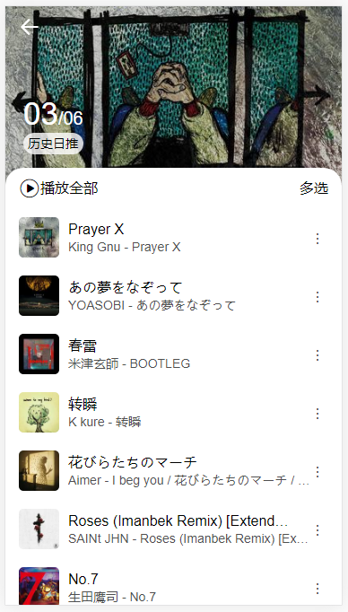

# 仿安卓网易云音乐App
> 基于vue+axios+vue-router+vuex+sass+flex布局开发  
> 后台使用了 [Binaryify 网易云音乐API](https://github.com/Binaryify/NeteaseCloudMusicApi)

## 功能和界面(点击下方在线地址直接查看):
- 实现滑动内容切换导航, 点击导航切换内容
- 封装全局自定义 loading, toast 插件
- 实现登录功能, 登录后获取用户精确推荐内容
- 搜索功能, 搜索页滑动到底部加载更多
- 发现页 -> 轮播, 可滑动的推荐歌单, 推荐歌曲, 推荐电台, 登录后切换为对用户的推荐内容
- 我的页 -> 未登录时展示登录入口, 推荐歌单, 登录后, 显示用户信息, 用户歌单
- 侧边栏, 登录后显示用户信息
- 路由跳转拦截, 登录后才能访问每日推荐 
- 排行榜, 每日推荐
- 推荐歌单, 歌单详情页, 点击歌曲播放音乐
- 音乐播放界面(待完善)

## 在线查看效果, PC浏览F12手机模式最佳
> [在线地址](http://63.209.32.7:3000)  

## <a id="预览图">预览图</a>  
- [首页](#首页)  
- [登录后刷新](#登录后刷新)  
- [侧边栏](#侧边栏)  
- [登录](#登录)  
- [搜索](#搜索)  
- [歌单广场](#歌单广场)  
- [歌单详情](#歌单详情)  
- [每日推荐](#每日推荐)  
- [播放界面(待完善)](#播放界面)  
- [排行榜](#排行榜)  

### <a id="首页">[首页](#预览图)</a> 
  
  
### <a id="登录后刷新主页">[登录后刷新主页](#预览图)</a>

### <a id="侧边栏">[侧边栏](#预览图)</a>

### <a id="登录">[登录](#预览图)</a>

### <a id="搜索">[搜索](#预览图)</a>


### <a id="歌单广场">[歌单广场](#预览图)</a>

### <a id="歌单详情">[歌单详情](#预览图)</a>
  
### <a id="每日推荐">[每日推荐](#预览图)</a>

### <a id="播放界面">[播放界面(待完善)](#预览图)</a>
  
### <a id="网易云排行榜">[网易云排行榜](#预览图)</a>
  

## 仅用于学习使用

## Project setup
```
npm install
```

### Compiles and hot-reloads for development
```
npm run serve
```

### Compiles and minifies for production
```
npm run build
```

### Lints and fixes files
```
npm run lint
```

### Customize configuration
See [Configuration Reference](https://cli.vuejs.org/config/).
